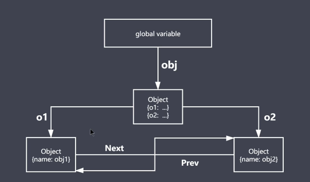
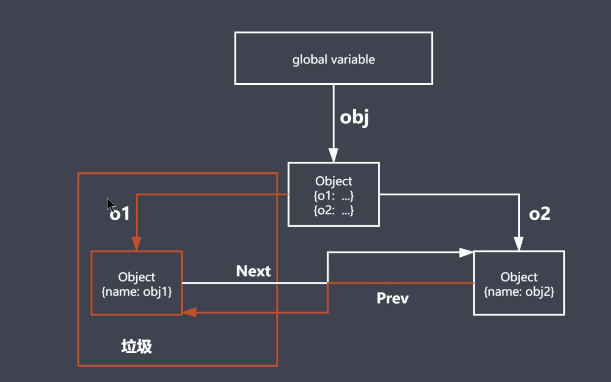
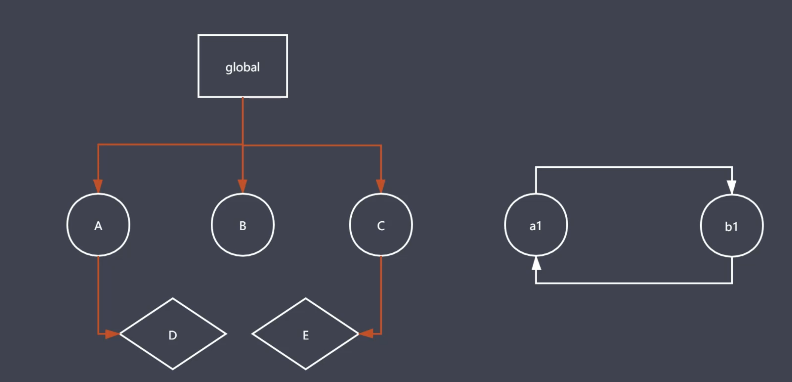
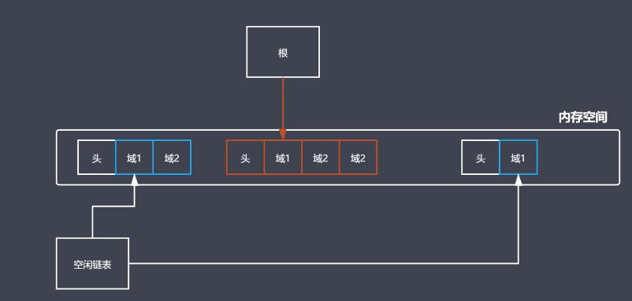
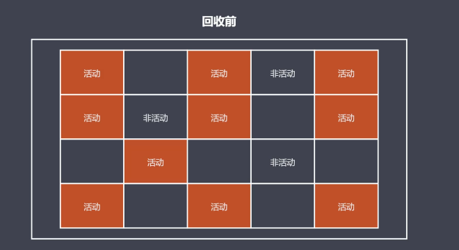
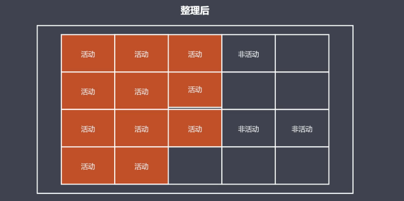
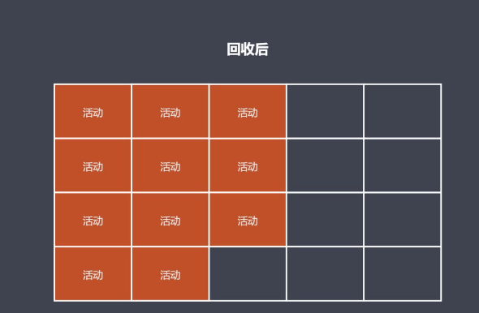
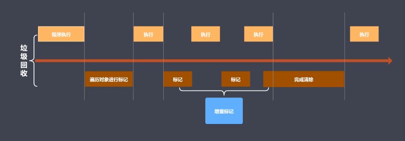

# JavaScript 性能优化
### 介绍
+ 性能优化是不可避免的
+ 哪些内容可以看做是性能优化
+ 无处不在的前端性能优化 
### 本阶段核心是JavaScript语言的优化
+ 内存管理
+ 垃圾回收与常见的GC算法
+ V8引擎的垃圾回收
+ Performance工具
+ 代码优化实例
### 内存管理 Memory Management
##### 内存管理介绍
+ 内存：由可读写单元组成，表示一片可操作空间
+ 管理：人为的去操作一片空间的申请、使用和释放
+ 内存管理：开发者主动申请空间、使用空间、释放空间
+ 管理流程：申请-使用-释放
```javascript
// 内存泄漏
function fn() {
    let arr = []
    arr[10000] = 'code'
}

fn()
```
+ 申请内存空间
+ 使用内存空间
+ 释放内存空间
```javascript
// 申请空间
let obj = {}
// 使用空间
obj.name = 'lg'
// 释放空间
obj = null
```
### JavaScript 垃圾回收
+ JavaScript中内存管理是自动
+ 对象不再被引用时是垃圾
+ 对象不能从根上访问到时是垃圾
#### JavaScript 中的可达对象
+ 可以访问到的对象就是可达对象(引用、作用域链)
+ 可达的标准就是从根出发是否能够被找到
+ JavaScript 中的根就可以理解为是全局变量
```javascript
// 这个对象被obj所引用
// obj是可以在根上被访问，obj也是个可达对象
let obj = {
    name: 'xm'
}

let al = obj
// 虽然obj被改为了null，但al还是引用着这个对象，所以还是一个可达对象
obj = null
```
#### 实例
```javascript
function objGroup(obj1, obj2) {
    obj1.next = obj2
    obj2.prev = obj1

    return {
        o1: obj1,
        o2: obj2
    }
}

let obj = objGroup({name: 'obj1'}, {name: 'obj2'})
console.log(obj)
// {
//     o1: { name: 'obj1', next: { name: 'obj2', prev: [Circular] } },
//     o2: { name: 'obj2', prev: { name: 'obj1', next: [Circular] } }
// }
```
##### 以上代码创建了一个对象区域，如下图:
+ 所有的对象都能从根上被找到

+ 但如果删除了根上的路径
```javascript
delete obj.o1
delete obj.o2.prev
```
+ 则obj.o1就不能从根上被找到，会被当做垃圾处理掉

### GC算法介绍
+ GC就是垃圾回收机制的简写
+ GC可以找到内存中的垃圾、并释放和回收空间
+ 被当成垃圾的标准：
  + 程序中不再需要使用对象，如下：当函数执行完后就不再需要name的变量，所以name会被当做是垃圾
```javascript
// 函数执行完后name就没有用
function fn () {
    name = 'lg'
    return `${name} is a coder`
}

fn()

// 函数外部不能再访问name
function fn2 () {
    const name = 'lg'
    return `${name} is a coder`
}

fn2()
```
##### GC算法是什么
+ GC是一种机制，垃圾回收器完成具体的工作
+ 工作的内容就是查找垃圾释放垃圾、回收空间
+ 算法就是工作时查找和回收所遵循的规则
+ 常见的GC算法
  + 引用计数：通过数字来判断对象是不是垃圾
  + 标记清除：在工作时给活动对象添加标记，来判断是否是一个垃圾
  + 标记整理：与标记清除类似，只是在回收过程时会做一些特别的事
  + 分代回收：在V8当中用到
### 引用计数算法
+ 核心思想：设置引用数，判断当前引用数是否为0，当引用数为0是会将当前空间回收
+ 引用计数器：
+ 引用关系改变时修改引用数字
+ 引用数字为0时立即回收
```javascript
const user1 = {age: 11}
const user2 = {age: 22}
const user3 = {age: 33}

const nameList = [user1.age, user2.age, user3.age]

function fn() {
    // num1和num2此时都是被挂载在全局上，所以引用次数都不为0
    num1 = 1
    num2 = 2
}

fn()

function fn2() {
    // num1和num2此时挂载在函数中
    // 当函数被调用结束时，两个变量的引用也为0
    const num1 = 1
    const num2 = 2
}

fn2()
```
### 引用计数算法的优缺点
##### 优点
+ 发现垃圾时立即回收
+ 最大限度减少程序暂停
##### 缺点
+ 无法回收循环引用的对象
+ 时间开销大
```javascript
function fn() {
    const obj1 = {}
    const obj2 = {}

    obj1.name = obj2
    obj2.name = obj1

    return 'lg'
}

// 虽然在全局下已经找不到obj1
// 但是obj2还是存在name指向obj1
// obj1的引用数不为0
// 引用计数就无法将obj1回收，会造成内存浪费
fn()
```
### 标记清除算法实现原理
+ 核心思想：分标记和清除两个阶段完成
+ 遍历所有对象找标记活动对象
+ 遍历所有对象清除没有标记对象
+ 回收相应的空间，放在空闲列表上，方便后面程序可以在这申请空间使用

##### 如图所示：标记清除会变量每个能被从根对象访问的可达对象进行标记，像a1和b1这种相互访问的情况就不会被标记，会被当做是垃圾回收
### 标记清除算法的优缺点
+ 相对于引用计数，在函数执行结束后标记清除算法会将函数内的变量清除，而引用计数若是引用数不为0则不会清除
+ 缺点：
  + 在图中中间部分能从根访问到，前后部分无法访问会被清除
  + 前后两头的域会被回收，头会被放入空闲列表等待
  + 当因为中间部分未清除，所以两个头的内存地址不连续
  + 当重新定义1.5个内存位置的数据，设置在前面会内存浪费，设置在后面会内存不足，造成标记清除的最大问题：空间碎片化(当前所回收的垃圾对象地址上本身是不连续的，这种不连续造成在回收之后分散在各个角落，后续想要使用，正好新空间与他们大小匹配可以直接用，一旦多了还是少了就不适合使用)

### 标记整理算法实现原理
+ 标记整理算法可以看做是标记清除的增强
+ 标记阶段的操作和标记清除一致，标记可达对象
+ 清除阶段会先执行整理，移动对象位置
##### 回收前

##### 整理后
+ 将活动对象进行移动，整理成连续的位置，将右侧的位置进行回收

##### 回收后
+ 回收后的空间基本是连续的，可以最大化利用当前内存空间中释放出来的空间

### 常见的GC算法总结
+ 引用计数：在内部通过引用计数器来作为对象的引用数值，通过计数器是否为0来判断是否是一个垃圾对象，从而回收它的垃圾空间，从而让垃圾回收器对空间进行垃圾回收释放
  + 优点：可以即时回收垃圾对象、减少程序的卡顿时间
  + 缺点：无法回收循环引用的对象、资源消耗较大
+ 标记清除：遍历所有对象，对所有可达对象进行标记，对没有标记的对象清除掉，从而释放这些垃圾对象所占用的空间
  + 优点：可以回收循环引用的空间
  + 缺点：容易产生碎片化空间，浪费空间、不会立即回收垃圾对象
+ 标记整理：与标签清除类似，在清除前会去整理当前的地址空间
  + 优点：减少碎片化空间
  + 缺点：不会立即回收垃圾对象
### V8
+ V8是一款主流的JavaScript执行引擎
+ V8采用即时翻译
+ V8内存有上限，64位不超过1.5G，32位不超过800M，原因:
  + V8本身是为了浏览器而创造的，现有的内存大小足够网页的使用
  + V8内部的垃圾回收机制决定了这样的方式比较合理：垃圾内存达到1.5G，V8采用增量标记的方法进行垃圾回收需要消耗50ms，而采用非增量标记的方法回收则需要1s，所以采用上限1.5G
### V8垃圾回收策略
+ 数据分为原始数据和对象类型数据，对于原始数据来说，都是由程序语言自身来控制的，所以回收都是指存在堆内的对象数据，离不开内存操作
+ 采用分代回收的思想
+ 内存分为新生代、老生代
+ 针对不同对象采用不同算法

##### V8中常用的GC算法
+ 分代回收
+ 空间复制
+ 标记清除
+ 标记整理
+ 标记增量
### V8如何回收新生代对象
##### 因为是基于分代的垃圾回收思想。所以V8内部是把空间分为两个部分：左侧白色空间存放新生代对象，右侧存放老生代对象

+ V8内存空间一分为二
+ 小空间用于存储新生代对象(32M|16M)
+ 新生代指的是存活时间较短的对象
##### 新生代对象回收实现
+ 回收过程采用复制算法+标记整理
+ 新生代内存区分为两个等大小空间
+ 使用空间为From，等闲空间为To
+ 活动对象存储于From空间
+ 标记整理后将活动对象拷贝至To
+ From与To交换空间完成释放
##### 回收细节说明
+ 拷贝过程中可能出现晋升
+ 晋升晋升将新生代对象移动到老生代
+ 一轮GC还存活的新生代需要晋升
+ To空间的使用率超过25%也需要移动到老年存储区存放：若To空间使用率较高，那么新进入的对象就不够放了
### V8如何回收老生代对象
+ 老生代对象存放在右侧老生代区域
+ 64位最大1.4G，32位最大700M
+ 老生代对象就是指存活时间较长的对象：在全局对象下的对象和闭包的数据
##### 老年代对象回收实现
+ 主要采用标记清除、标记整理、增量标记算法
+ 首先使用标记清除完成垃圾空间的回收
+ 采用标记整理进行空间优化：要将新生代对象往老生代存储，但老生代内存又不足时，会触发标记整理进行碎片回收，使老生代有更多的空间存储
+ 采用增量标记进行效率优化
##### 细节对比
+ 新生代区域垃圾回收试验空间换时间
+ 老生代区域垃圾回收不适合复制算法：老生代空间较大，一分为二只剩几百M空间浪费不用，而且复制消耗时间较多
##### 标记增量如何优化垃圾回收
+ 程序运行与垃圾回收交替执行，将垃圾回收拆分成多个小步骤组合地完成当前回收，从而替代之前的一口气做完的垃圾回收
+ 标记可以不一次性完成，存在直接可达和间接可达对象，可以先标记执行可达对象，再执行一小断代码，再标记间接可达对象，等完全标记结束后再执行垃圾回收操作

### V8垃圾回收总结
+ V8是一款主流的JavaScript执行引擎
+ V8内存设置上限
+ V8采用基于分代回收思想实现垃圾回收
+ V8内存分为新生代和老生代
+ V8垃圾回收常见的GC算法
### Performance 工具介绍
+ 为什么使用Performance
  + GC的目的是为了实现内存空间的良性循环
  + 良性循环的基石是合理使用，因为并没有为程序员提供操作内存空间的API，无法知道是否合理，都是由GC完成操作的
  + 时刻关注才能确定是否合理：为了判断内存是否合理就必须要使用performance来时刻关注内存变化
  + Performance提供多种监控方式
+ 通过Performance时刻监控内存，在程序出现问题时能快速找到当前的代码块
##### Performance 使用步骤
+ 打开浏览器输入目标网址
+ 进入开发人员工具面板，选择性能
+ 开启录制功能，访问具体界面
+ 执行用户行为，一段时间后停止录制
+ 分析界面中记录的内存信息
### 内存问题的体现
+ 页面出现延迟加载或经常性暂停
+ 页面持续性出现糟糕的性能
+ 页面的性能随时间延迟越来越差
### 监控内存的几种方式
##### 界定内存问题的标准
+ 内存泄漏：内存使用持续升高
+ 内存膨胀：在多数设备上都存在性能问题
+ 频繁垃圾回收：通过内存变化图进行分析
##### 监控内存的几种方式
+ 浏览器任务管理器
+ Timeline时序图记录
+ 堆快照查找分离DOM
### 任务管理器监控内存
+ 快捷键shift+Esc打开
+ 主要关注内存和JavaScript内存两个数据
+ 内存：指的是原生内存，也就是当前页面的DOM节点所占据的内存，这个数据在不断增大声明页面在持续创建新DOM
+ JavaScript内存：表示的是JavaScript的堆，需要关注小括号内的值，表示的是页面所有可达对象正在使用的内存大小，这个数值在持续增加说明在不断创建新对象或现有对象在不断增长，可以监控脚本运行时的内存变化
### Timeline 记录内存
+ 打开性能，点开录制
+ 模仿用户操作
+ 分析用户走势图
+ 可以帮助开发者发现是否有问题，也能定位问题是在哪个时间点发生的
### 堆快照查找分离DOM
##### 工作原理
+ 找到相应的JS堆
+ 对照片进行留存，通过照片可以看到所有信息
##### 什么是分离DOM
+ 界面元素存活在DOM树上
+ 垃圾对象时的DOM节点：从当前DOM树上脱离，并且js代码中也没用再引用这个节点
+ 分离状态的DOM节点：从当前DOM树上脱离，但是js代码中还在引用这个节点，这种DOM在界面上是看不见的，但是在内存中是占据着空间的
##### 快速使用
+ 打开浏览器控制台
+ 找到内存面板，找到堆块照选项
+ 初始时拍下一张照片，模仿用户后再拍一张
+ 搜索deta查找分离DOM
+ 可以使用浏览器的堆块照功能，对堆进行拍照，拍完照后查找是否存在分离DOM，因为分离DOM在页面中不体现，但是在内存中的确存在，这样就会内存浪费，这样就能定位到代码中所在的位置，再想办法给清除掉
### 判断是否存在频繁GC
##### 为什么确定频繁垃圾回收
+ GC工作时应用程序是停止的
+ 频繁且过长的GC会导致应用假死
+ 用户使用中感知应用卡顿
##### 如何确定是否有频繁的垃圾回收
+ Timeline中频繁的上升下降
+ 任务管理器中数据频繁的增加减少
+ 确定后在代码中进行内存操作，定位代码中的问题，使代码更加快捷
### Performance总结
+ Performance使用流程，对内存进行适当的监控
+ 内存问题的相关分析(内存泄漏、内存膨胀、频繁GC)
+ Performance时序图监控内存变化，可以记录程序内的内存走势，监控当前内存是如何变化的，从而定位到有问题的时间节点所做的操作，再定位到代码中的内容
+ 任务管理器监控内存变化(当前DOM节点所占用的内存变化和当前JS堆的内存变化，如果发现持续增加说明代码有不断的内存申请，需要考虑代码中是否有不足)
+ 堆块照查找分离DOM：分离DOM必然存在内存泄漏的现象，如果这种代码越来越多，程序会存在随着使用时间的增长出现使用情况越来越糟糕的情况
### 代码优化介绍
##### 如何精准测试JavaScript性能
+ 本质上就是采集大量的执行样本进行数学统计和分析
+ 使用基于Benchmark.js的 https://jsperf.com/ 完成
##### Jsperf使用流程
+ 使用GitHub账号登录
+ 填写个人信息(非必须)
+ 填写详细的测试用例信息(title、slug)
+ 填写准备代码(DOM操作时经常使用)
+ 填写必要的setup和teardown代码
+ 填写测试代码片段
### 慎用全局变量
+ 全局变量定义在全局执行上下文，是所有作用域链的顶端，若是在局部作用域中查不到需要的变量就会查找到全局，增加了消耗时间
+ 全局执行上下文一直存在于上下文执行栈，直到程序退出，不利于GC操作，降低对内存的使用
+ 如果局部作用域出现了同名变量则会遮蔽或污染全局
```javascript
var i,str = ''
for (i = 0; i < 1000; i++) {
    str += i
}

// 局部性能比全局性能要高得多
for (let i = 0; i < 1000; i++) {
    let str = ''
    str += i
}
```
### 缓存全局变量
##### 将使用中无法避免的全局变量缓存到局部
```javascript
function getBtn() {
    let obtn1 = document.getElementById('btn1')
    let obtn3 = document.getElementById('btn3')
    let obtn5 = document.getElementById('btn5')
}

// 性能上有所提高
function getBtn2() {
    let obj = document
    let obtn1 = obj.getElementById('btn1')
    let obtn3 = obj.getElementById('btn3')
    let obtn5 = obj.getElementById('btn5')
}
```


