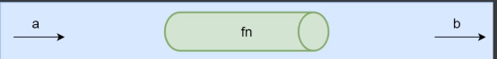
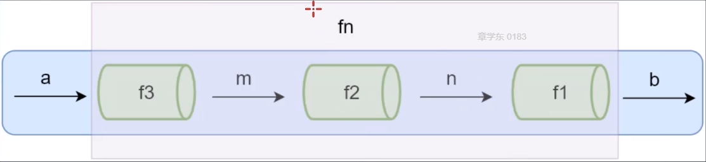

# 函数式编程
+ 介绍
  + 为什么学函数式编程以及什么是函数式编程
  + 函数式编程的特性(纯函数、柯里化、函数组合等)
  + 函数式编程的应用场景
  + 函数式编程库 Lodash

### 为什么学函数式编程
+ 函数式编程随着React的流行受到越来越多的关注
+ Vue3也开始使用函数式编程
+ 函数式编程可以抛弃this
+ 打包过程中可以更好的利用tree shaking过滤无用代码
+ 方便测试、方便并行处理
+ 有很多库可以帮助我们进行函数式开发、ladash、underscore、ranmda

### 函数式编程概念
##### 函数式编程(Functuinal Programming)，简称FP，编程规范还有面向过程、面向对象编程
+ 函数式编程思维方式：把现实世界的事物和事物之间的联系抽象到程序世界(对运算过程进行抽象)
  + 本质：根据输入通过某种运算获得相应的输出，程序开发会涉及很多有输入输出的函数
  + x -> f(联系,映射) -> y , y=f(x)
  + 函数式编程中的函数指的不是程序中的函数(方法)，而是数学中的函数映射关系，例如 y=sin(x),x和y的关系
  + 相同的输入始终要得到相同的输出(纯函数)
  + 函数式编程用来描述数据(函数)之间的映射
```javascript
// 非函数式
let num1 = 2
let num2 = 3
let sum = num1 + num2


// 函数式
function sum(a, b) {
    return a + b
}

// 函数式编程：当输入相同时输出也相同
// 特点：可以重复使用
let num1 = sum(2, 3)
console.log(num1) // 5

let num2 = sum(2, 3)
console.log(num2) // 5

let num3 = sum(2, 3)
console.log(num3) // 5
```


### 函数是一等公民 First-class-Function
+ 函数可以存储在变量中
+ 函数可以作为参数
+ 函数可以作为返回值
因为在JavaScript中函数就是一个普通的对象(可以通过new创建)，可以把函数存储在变量中，也可以作为另一个函数的参数和返回值，也可以在程序运行时通过new来创建一个新的函数

##### 把函数赋值给变量
```javascript
// 函数可以存储在变量中
let fn = function () {
    console.log('first-class-function')
}

// 示例
const obj = {
    index (posts) {
        return View.index(posts)
    },
    show (post) {
        return View.show(post)
    }
}

// 传入的参数与返回值的函数参数相同

// 优化后 代码量减少但功能不变
const obj = {
    index: View.index,
    show: View.show
}
```
##### 函数是一等公民是后面学习的高阶函、柯里化等的基础

#### 高阶函数 Higher-order function
+ 可以把函数作为参数传递给另一个函数
```javascript
// 函数作为参数

function each(arr, fn) {
    for (let i = 0; i < arr.length; i++) {
        fn(arr[i])
    }
}

let arr = [1, 2, 3, 4]
each(arr, function (i) {
    console.log(i) // 1 2 3 4
})

// filter
function filter(arr, fn) {
    let result = []
    for (let i = 0; i < arr.length; i++) {
        if (fn(arr[i])) {
            result.push(arr[i])
        }
    }
    return result
}

filter(arr, function (i) {
    return i % 2 === 0
}) // [2, 4]
```
+ 可以把函数作为另一个函数的返回值
```javascript
// 函数可以作为返回值

function makeFn() {
    let msg = 'Hello function'
    return function () {
        console.log(msg)
    }
}

const fn = mskeFn()
fn()

makeFn()() // fn()


function once(fn) {
    let done = false
    return function () {
        if (!done) {
            // 当done被修改为true之后就无法再执行
            done = true
            return fn.apply(this, arguments)
        }
    }
}

let pay = once(function (money) {
    console.log(`支付：${money}块钱`)
})

pay(100) // 支付：100块钱
pay(100)
pay(100)
pay(100)
```
### 高阶函数的意义
+ 抽象可以屏蔽细节，只需要关注目标
+ 高阶函数是用来抽象通用的问题
+ 使代码更简洁
```javascript
// 面向过程的方式
let arr = [1, 2, 3, 4]
for (let i = 0; i < arr.length; i++) {
    console.log(arr[i]) // 1 2 3 4
}


// 高阶函数
function filter(arr, fn) {
    let result = []
    for (let i = 0; i < arr.length; i++) {
        if (fn(arr[i])) {
            result.push(arr[i])
        }
    }
    return result
}

// 不需要考虑代码内部是怎样实现的
// 代码更加简洁
filter(arr, function (i) {
    return i % 2 === 0
}) // [2, 4]
```
### 常用的高阶函数
##### map every some
```javascript
// map

const map = (arr, fn) => {
    let result = []
    for (const value of arr) {
        result.push(fn(value))
    }
    return result
}

let arr = [1, 2, 3, 4]
arr = map(arr, v => v * v) // [1, 4, 9, 16]


// every
const every = (arr, fn) => {
    let result = true
    for (const value of arr) {
        result = fn(value)
        if (!result) {
            break
        }
    }
    return result
}

let arr2 = [11, 50, 100]
let bool1 = every(arr2, i => i > 10) // true
let bool2 = every(arr2, i => i > 20) // false


// some
const some = (arr, fn) => {
    let result = false
    for (const value of arr) {
        result = fn(value)
        if (result) {
            break
        }
    }
    return result
}

let arr3 = [1, 6, 7]
let result1 = some(arr3, i => i % 2 === 0) // true
let arr4 = [1, 3, 7]
let result2 = some(arr4, i => i % 2 === 0) // false
```
## 闭包 Closure
### 概念
+ 函数和周围的状态(词法环境)的引用捆绑在一起形成闭包
  + 可以在另一个作用域中调用一个函数的内部函数并访问到该函数的作用域中的成员
```javascript
// 函数作为返回值，且返回的函数调用了函数的变量
function mater() {
    let msg = 'hello'
    return function () {
        // 函数内没有定义msg，访问了外部函数中的msg
        console.log(msg)
    }
}

const fn = mater()
fn() // hello
```
##### 示例：once()函数
```javascript
// once 延长了外部函数变量的作用范围
function once(fn) {
    let done = false
    return function () {
        if (!done) {
            done = true
            return fn.apply(this, arguments)
        }
    }
}

let pay = once(function (num) {
    console.log(num)
})

pay(1) // 1 执行完done为true，无法再执行
pay(2) 
pay(3) 
```
+ 闭包的本质：
  + 函数在执行时会放到一个执行栈上，当执行完毕后会从执行栈中移除，但是堆上的作用域成员因为被外部引用而不能释放，因此内部函数依然可以 访问外部函数的成员

##### 示例：求数字的次方
```javascript
// 示例
function makePower (power) {
    return function (number) {
        return Math.pow(number,power)
    }
}

let power2 = makePower(2) // 平方函数
let power3 = makePower(3) // 立方函数

console.log(power2(3)) // 9
console.log(power2(4)) // 16
console.log(power3(2)) // 8

// 加成
function makeSalary (num1) {
    return function (num2) {
        return num1 + num2
    }
}

let salary1200= makeSalary(1200)
let salary3200= makeSalary(3200)

console.log(salary1200(2000)) // 3200
console.log(salary3200(1000)) // 4200
```
### 纯函数
##### 概念
+ 纯函数：相同的输入始终会得到相同的输出，而且没有任意可观察的"副作用"
  + 纯函数就类似数学中的函数(用来描述输入和输出之间的关系)，y=f(x)
  + loadsh是一个纯函数的功能库，提供了对数组、对象、数字、对象、字符串、函数等操作的一些方法
  + 数组的slice和splice分别是：纯函数和非纯函数
    + slice 返回数组中的指定部分，不会改变原数组
    + splice 对数组进行操作返回该数组，会改变原数组
```javascript
// slice / splice
let arr = [1, 2, 3, 4, 5]

console.log(arr.slice(0,2)) // [1, 2]
console.log(arr.slice(0,2)) // [1, 2]
console.log(arr.slice(0,2)) // [1, 2]

// 在函数中对数组进行改变，每次的输出也不同
console.log(arr.splice(0, 1)) // [1]
console.log(arr.splice(0, 1)) // [2]
console.log(arr.splice(0, 1)) // [3]

// 手写纯函数

function sum(n, m) {
    return n + m
}

console.log(sum(1,2)) // 3
console.log(sum(1,2)) // 3
console.log(sum(1,2)) // 3
```
+ 函数式编程不会保留计算中间的结果，所以变量是不可变的(无状态的)
+ 可以把一个函数的执行结果交给另一个函数去处理
### Lodash
##### 现代的实用的JavaScript库，提供了模块化、高性能和一写附加的功能，还提供了一些函数式编程的方法，函数式组合、柯里化
##### 快速安装
+ 初始化，生成package.json配置文件：npm init -y
+ 安装lodash：npm i lodash
+ 在模块中引入
```javascript
// 引入lodash
const _ = require('lodash')

const arr = ['jreey', 'tom', 'kitty']

// first / last / toUpper / reverse / each / includes / find / findIndex

console.log(_.first(arr)) // jreey
console.log(_.last(arr))  // kitty
console.log(_.toUpper(_.first(arr))) // JREEY
console.log(_.reverse(arr))  // [ 'kitty', 'tom', 'jreey' ]
const resilt = _.each(arr, (item, index) => {
    console.log(item, index) // kitty 0 tom 1 jreey 2
})
console.log(resilt) // [ 'kitty', 'tom', 'jreey' ]
```
### 纯函数的优势
+ 可缓存
  + 因为纯函数对相同的输入始终有相同的结果,可以把函数的执行结果缓存起来，参数相同时则可以直接返回，提高性能
```javascript
// lodash提供了一个带有缓存的记忆函数
const _ = require('lodash')

function getArea(r) {
    console.log(r)
    return Math.PI * r * r
}

let getAreaWithMemory = _.memoize(getArea)
console.log(getAreaWithMemory(4)) // 4 50.26
console.log(getAreaWithMemory(4)) // 50.26
console.log(getAreaWithMemory(4)) // 50.26
// 只打印了一次4，说明从第二次开始并没有执行getArea方法
// 只是在缓存中拿到这个值

// 模拟memoize内部实现
function memoize(fn) {
    let cache = {}
    return function () {
        let key = JSON.stringify(arguments)
        cache[key] = cache[key] || fn.apply(fn, arguments)
        return cache[key]
    }
}

let getAreaWithMemory2 = memoize(getArea)
console.log(getAreaWithMemory2(4)) // 4 50.26
console.log(getAreaWithMemory2(4)) // 50.26
console.log(getAreaWithMemory2(4)) // 50.26
```
+ 可测试
  + 纯函数方便测试，适合单元测试
+ 方便并行处理
  + 在多线程环境下并行操作共享的内存数据很可能会出现意外情况
  + 纯函数不需要访问共享的内存数据，所以在并行环境下可以任意运行纯函数(Web Worker)
+ 可能将纯函数组合成功能更加强大的函数
### 纯函数的副作用
+ 副作用会使一个函数变得不纯，纯函数根据相同的输入返回相同的输出，如果函数依赖于外部的状态就无法保证相同的输出，会有副作用,例如：
```javascript
// 不纯的
let min = 18
function checkAge (age) {
    return age > min
}

checkAge(20) // true
min = 25
checkAge(20) // false

// 纯函数
function checkAge2(age) {
    // 硬编程问题，可用柯里化解决
    let min = 18
    return age > min
}

checkAge2(20) // true
checkAge2(20) // true
```
+ 副作用来源
  + 配置文件
  + 数据库
  + 获取用户的输入
  + ......
+ 所有的外部交互都有可能导致副作用，副作用会使方法通用性下降不利于扩展和可重用性，同时副作用会给程序中带来安全隐患，给程序带来不确定性，但是副作用不可能完全禁止，尽可能控制它们在可控范围内发生
### 柯里化
+ 使用柯里化解决上个案例中的硬编程问题
+ 柯里化：当函数拥有多个参数时可以将函数改造，调用函数只传入部分函数，并且让函数返回新的函数，新的函数传入剩余的参数并返回结果
```javascript
// 修改
function checkAge2(age, min) {
    return age > min
}

console.log(checkAge2(18, 20)) // false
console.log(checkAge2(18, 24)) // false
console.log(checkAge2(22, 24)) // false

// 柯里化修改
function checkAge3(min) {
    return function (age) {
        return age > min
    }
}

let checkAge18 = checkAge3(18)
let checkAge20 = checkAge3(20)

console.log(checkAge18(20)) // true
console.log(checkAge18(24)) // true
console.log(checkAge20(18)) // false

// 柯里化 es6写法
let checkAge4 = min => (age => age > min)
// 先传递一部分参数，且这部分参数永远不会发生变化
let checkAge10 = checkAge4(10)
// 新的函数接收剩余参数并返回结果
console.log(checkAge10(20)) // true
```
### Lodash中的柯里化
+ _.curry(fn)
  + 创建一个函数，该函数接收一个或多个fn的参数，如果fn所需要的参数都被提供则执行fn并返回结果，否则继续返回该函数并等待接收剩余的参数
    + 参数：需要柯里化的函数
    + 返回值：柯里化后的函数
```javascript
// _.curry(fn)
const _ = require('lodash')

function getSum(a, b, c) {
    return a + b + c
}

const curried = _.curry(getSum)

console.log(curried(1, 2, 3)) // 6
console.log(curried(1)(2, 3)) // 6
console.log(curried(1, 2)(3)) // 6
```
### 柯里化案例
+ 优点：函数柯里化后还是的可复用性提高，可以重复使用
```javascript
// 使用面向过程的方式提取字符串中的空格和数字
'adas  s2da'.match(/\s+/g)
'asdas347468 76873'.match(/\d+/g)

const _ = require('lodash')
const match = _.curry(function name(reg, str) {
    return str.match(reg)
})

const getSpace = match(/\s+/g)
console.log(getSpace('he kon')) // [ ' ' ]

const getNumber = match(/\d+/g)
console.log(getNumber('123s321')) // [ '123', '321' ]

// 过滤数组中的字符串中符合对象的值
const filter = _.curry(function (fn, arr) {
    return arr.filter(fn)
})

console.log(filter(getSpace,['tom jerry','tom ','jerry'])) // [ 's s', '1 1 ' ]

const findSpace = filter(getSpace)
console.log(findSpace(['tom jerry','tom','jerry'])) // [ '2 2' ]
```
### 柯里化原理实现
+ 传入一个函数和若干个参数
+ 返回一个函数，这个函数保留部分参数
+ 若参数个数与传入的函数参数个数相同则执行并返回结果，否则继续返回一个函数并合并参数和保存
```javascript
function curry (fn) {
    // 第一次传递的参数会被记录在args中
    return function curryfn(...args) {
        // 判断实参和形参的个数
        if (args.length < fn.length) {
            return function () {
                // 将保存的参数与当前函数参数合并到一起再返回一个新的函数
                return curryfn(...args.concat(Array.from(arguments)))
            }
        }
        // 参数个数相同则调用并返回
        return fn(...args)
    }
}

function getSum(a, b, c) {
    return a + b + c
}

const curried = curry(getSum)
console.log(curried(1, 2, 3)) // 6
console.log(curried(1)(2, 3)) // 6
console.log(curried(1, 2)(3)) // 6
```
### 函数柯里化总结
+ 柯里化可以让我们给一个函数传递较少的参数并得到一个已经记住某些固定参数的新函数
+ 这是一种对函数参数的缓存
+ 让函数变得更加灵活，让函数的粒度更小
+ 可以把多元函数转换成一元函数(一个参数)，可以组合使用函数变成更加强大的函数
### 函数组合
+ 纯函数和柯里化很容易写出洋葱代码 H(f(g(x)))
  + 获取数组的最后一个元素再转换成大写字母 _.toUpper(_.first(_.reverse(arr)))
+ 函数组合可以让我们把细粒度的函数重新组成一个新的函数
#### 管道
+ 给fn函数输入参数a，返回结果b，想象成数据a通过管道(函数)fn得到了数据b


+ 当fn比较复杂时，可以把fn拆分成多个小函数，此时多了中间运行产生的m和n


```javascript
fn = compose(f1, f2, f3)
b = fn(a)
```
### 函数组合
##### 实例
+ 可以重复多次使用
```javascript
// 执行顺序 从右到左
function compose(f, g) {
    return function (val) {
        return f(g(val))
    }
}

function reverse(arr) {
    return arr.reverse()
}

function first(arr) {
    return arr[0]
}
// 将多个函数组合成一个函数
// 将一个函数的结果作为另一个函数的参数
// 当最后一个函数被处理结束后会被返回最终结果
const last = compose(first, reverse)

const arr = [1,5,6,9]
console.log(last(arr)) // 9
```
### Lodash中的组合函数
+ lodash中组合函数flow()或者flowRight()都可组合多个函数
+ flow()是从左往右执行
+ flowRight()是从右往左执行，使用的更多
```javascript
const _ = require('lodash')

const reverse = arr => arr.reverse()
const first = arr => arr[0]
const toUpper = str => str.toUpperCase()

const f = _.flowRight(toUpper, first, reverse)

console.log(f(['tom', 'jerry', 'lucy'])) // LUCY
```
### 模拟函数组合原理
```javascript
// 模拟组合函数
const reverse = arr => arr.reverse()
const first = arr => arr[0]
const toUpper = str => str.toUpperCase()

function compose(...args) {
    return function (value) {
        // 反转数组并value作为参数输入到函数中
        return args.reverse().reduce(function (acc, fn) {
            return fn(acc)
        }, value)
    }
}

// 箭头函数写法
const compose2 = (...args) => value => args.reverse().reduce((acc, fn) => fn(acc),value)

const f2 = compose2(toUpper, first, reverse)

console.log(f2(['tom', 'jerry', 'lucy'])) // LUCY
```
### 函数组合结合律
+ 函数组合要满足结合律
  + 可以把f和g组合，还可以把g和h组合，结果都是一样的
```javascript
let f = compose(f, g, h)
let associative = compose(compose(f, g), h)  === compose(f, compose(g, h)) // true
```
### 示例
```javascript
const _ = require('lodash')

const f1 = _.flowRight(_.toUpper, _.first, _.reverse)

const f2 = _.flowRight(_.flowRight(_.toUpper, _.first), _.reverse)

const f3 = _.flowRight(_.toUpper, _.flowRight(_.first, _.reverse))

console.log(f1(['one', 'two', 'three'])) // THREE
console.log(f2(['one', 'two', 'three'])) // THREE
console.log(f3(['one', 'two', 'three'])) // THREE
```
### 函数组合-调试
##### 函数的结果与预期的不同，如何调试
##### 因为组合函数都是由方法作为参数构成的，可以在一个方法的后面添加一个方法进行打印，通过辅助函数来了解每个函数输出后的结果
```javascript
const _ = require('lodash')

const split = _.curry((sep, str) => _.split(str, sep))

const join = _.curry((sep, arr) => _.join(arr, sep))

const f = _.flowRight(join('-'), _.toLower, split(' '))
console.log(f('Never Say Die')) // n-e-v-e-r-,-s-a-y-,-d-i-e

const trace = _.curry((target, val) => {
    console.log(target, val)
    return val
})
const f2 = _.flowRight(join('-'), trace('toLowen 输出值：'), _.toLower,trace('split 输出值：'), split(' '))
// split 输出值： [ 'Never', 'Say', 'Die' ]
// toLowen 输出值： never,say,die
// 根据打印结果显示：因为toLower结果为字符串，join需要的是数组，所以与预期返回值不同
console.log(f2('Never Say Die')) 

const map = _.curry((fn, arr) => _.map(arr, fn))
const f3 = _.flowRight(join('-'), map(_.toLower), split(' '))
console.log(f3('Never Say Die')) // never-say-die
```
### Lodash中的FP模块
+ lodash的fp模块提供了实用的对函数式编程友好的方法
+ 提供了不可变 auto-curried iteratee-first data-last 的方法
```javascript
// 函数在前数据往后
const fp = require('lodash/fp')

const f = fp.flowRight(fp.join('-'), fp.map(fp.toLower), fp.split(' '))

console.log(f('NEVER SAY DIE')) // never-say-die
```
### lodash-map方法的问题
+ lodash-map 方法会传出三个参数被parseInt方法接收
+ lodash-fp-map 方法只会有一个参数被parseInt方法接收
```javascript
// lodash  数据优先  函数之后
const _ = require('lodash')
console.log(_.map(['23', '5', '31'], parseInt)) // [ 23, NaN, NaN ]
// parseInt('23', 0, array) parseInt 第二个参数为转换成几进制 0 默认为十进制
// parseInt('5', 1, array)  
// parseInt('31', 2, array) 

// lodash fp
const fp = require('lodash/fp')
// 处理的参数不同，只处理当前的值
console.log(fp.map(parseInt, ['23', '5', '31'])) // [ 23, 5, 31 ]
```
## Point Free
+ Point Free:可以把数据处理的过程定义成与数据无关的合成运算，不需要用到代表数据的参数，只要把简单的运算步骤合在一起，在使用这种方法之前需要定义辅助的基本运算函数
  + 不需要指明处理的数据
  + 只需要合成运算过程
  + 需要定义一些辅助的基本运算函数
```javascript
const fp = require('lodash/fp')

const f = fp.flowRight(fp.replace(/\s+/g,'_'), fp.toLower)

console.log(f('Hello World')) // hello_world
```
### Point Free 案例  worle wild web ==> W.W.W
```javascript
const fp = require('lodash/fp')
// 分割字符串 => 转换大写 => 提取第一个字母 => 拼接成字符串  fp.map 遍历了两次  能将两步在同一步骤一起完成
const firstLetterToUpper1 = fp.flowRight(fp.join('.'), fp.map(fp.first), fp.map(fp.toUpper), fp.split(' '))

console.log(firstLetterToUpper1('worle wild web')) // W.W.W
// 分割字符串 => 转换大写并提取第一个字母 => 拼接成字符串  fp.map 遍历了一次
const firstLetterToUpper2 = fp.flowRight(fp.join('.'), fp.map(fp.flowRight(fp.first, fp.toUpper)), fp.split(' '))

console.log(firstLetterToUpper2('worle wild web')) // W.W.W
```
### 函子
##### 为什么要学函子
+ 到目前为止已经学了函数式编程的基础，但还没有演示如何在函数式编程中把副作用控制在可控的范围内、异常处理、异步操作等
##### 什么是Functor
+ 容器：包含值和值的变形关系(这个变形关系就是函数)
+ 函子：是一个特殊的容器，通过一个普通对象来实现，该对象具有map方法，map方法可以运行一个函数对值进行处理(变形关系)
+ 特点：
  + 会保存创建时传入的value值并不会对外公布
  + 由方法对value值进行处理或运算
  + 处理结束后返回一个新的函子对象并把运算结果作为新对象的value值保存
  + 可以重复使用方法对上个结果值进行处理
```javascript
class Container {
    constructor (value) {
        // 维护一个值 永远不对外公布
        this._value = value
    }
    // 通过map方法传入的方法对value进行处理
    // 并返回一个新的函子对象并保存结果值
    map (fn) {
        return new Container(fn(this._value))
    }
}

// 创建一个函子对象，调用map方法，并返回一个新的函数对象
// 因为返回值也是函子对象，所以可以使用链式的方法继续调用
const result = new Container(5)
    .map(x => x + 1) // 6
    .map(x => x * x) // 36

console.log(result) // Container { _value: 36 }

// 创建静态方法来返回一个新的Container对象
class Container2 {
    constructor (value) {
        this._value = value
    }
    map (fn) {
        return Container.create(fn(this._value))
    }
    static create (value) {
        return new Container(value)
    }
}

const result2 = Container2.create(5)
    .map(x => x * x) // 25
    .map(x => x + 1) // 26

console.log(result2) // Container { _value: 26 }
```
#### 总结
+ 函数式编程的运算不直接操作值，而是由函子完成
+ 函子就是一个实现了map契约的对象
+ 我们可以把函子想象成一个盒子，这个盒子里封装了一个值
+ 想要处理盒子中的值，想要给盒子的map方法传递一个处理值的函数(纯函数)，由这个还是来对值进行处理
+ 最终map方法返回一个包含新值的盒子(函子)
+ 但若是传入的值类型与预期不同，就会把函数变为不纯的(报错)，需要将这种情况控制在可控的范围内
### MayBe 函子
+ 在编程的过程中可能会遇到很多问题，需要对这些错误做相应的处理
+ MayBe 函子的作用就是可以对外部的空值情况做处理(控制副作用在允许的范围)
+ 优点：能在对数据处理前对数据进行判断
+ 缺点：若是存在多个回调，其中有回调返回的是null，不容易找到这个null是由哪段函数返回的
```javascript
class MayBe {
    constructor (value) {
        this._value = value
    }
    static create (value) {
        return new MayBe(value)
    }
    map (fn) {
        return this.isNothing() ? MayBe.create(null) : MayBe.create(fn(this._value))
    }
    // 判断方法的值是否为空值，为空值时不调用函数
    isNothing () {
        return this._value === null || this._value === undefined
    }
}

const result = MayBe.create('Hello word')
    .map(x => x.toUpperCase())
console.log(result) // MayBe { _value: 'HELLO WORD' }

// 接收一个null，这该值不会进行map中的处理，直接返回null
const result2 = MayBe.create(null)
    .map(x => x.toUpperCase())
console.log(result2) // MayBe { _value: null }

// 缺点：若是多次使用map，其中有一次返回值为null
// 不容易判断该null是由哪个方法返回的
const result3 = MayBe.create('Hello word')
    .map(x => x.toUpperCase())
    .map(x => null)
    .map(x => x.split(''))
console.log(result3) // MayBe { _value: null }
```
### Either 函子
+ Either 两者中的任何一个，类似于if...else...的处理
+ 异常会让函数变的不纯，Either函子可以用来做异常处理
```javascript
// Left 记录函子中的错误信息
class Left {
    constructor (value) {
        this._value = value
    }
    static create (value) {
        return new Left(value)
    }
    map (fn) {
        return this
    }
}
// Right 使用回调对数据进行正确的处理
class Right {
    constructor (value) {
        this._value = value
    }
    static create (value) {
        return new Right(value)
    }
    map (fn) {
        return Right.create(fn(this._value))
    }
}

function parentJSON(str) {
    try {
        return Right.create(JSON.parse(str))
    }catch (e) {
        return Left.create({error : e.message})
    }
}

const result = parentJSON('{name: zxd}')
.map(x => x.name.toUpperCase()) // 因为Left保存的是错误结果所以不会执行函数直接返回
// 输出了Left 并保存的错误信息
console.log(result) // Left { _value: { error: 'Unexpected token n in JSON at position 1' } }

const result2 = parentJSON('{"name": "zxd"}')
    .map(x => x.name.toUpperCase())
// 输出了Rigt 并保存结果
console.log(result2) // Right { _value: 'ZXD' }
```
### IO函子
+ IO 函子中的_value 是一个函数，这里把函数作为值来处理
+ IO 函子可以把不纯的函数存储到_value中，延迟执行这个不纯的操作(惰性操作)，包装当前的操作
+ 把不纯的操作交给调用者来处理
```javascript
const fp = require('lodash')

class IO {
    constructor (fn) {
        this._value = fn
    }
    static create (value) {
        return new IO (function () {
            return value
        })
    }

    map (fn) {
        // 把两个函数组合起来作为新IO函数的值
        return new IO(fp.flowRight(fn, this._value))
    }
}

const result = IO.create(process)
    .map(p => p.execPath) // 打印node的路径
console.log(result) // IO { _value: [Function] }
// 把不纯的操作延迟到执行时
console.log(result._value()) // D:\node\node.exe
```
### folktale-Task
+ 异步任务的实现过于复杂，使用folktale中的Task演示
+ folktale是一个标准的函数式编程库
  + 和lodash、ramda 不同的是，它没有提供很多功能函数
  + 只提供了一些函数式处理的操作，例如：compose、curry等，一些函子Task、Either、MayBe等
  + 快速安装： npm i folktale
  + folktale 中的 compose 、 curry 使用
```javascript
const {compose, curry} = require('folktale/core/lambda')
const {toUpper, first} = require('lodash/fp')

// 第一个参数为参数的个数
// 若传入的参数不满足这个个数则会返回一个新的函数
// 若传入的参数达到这个个数则执行回调
let f = curry(2, (x, y) => {
    return x + y
})

console.log(f(1, 2)) // 3
console.log(f(1)(2)) // 3

let c = compose(toUpper, first)
console.log(c(['hello','world'])) // HELLO
```
+ Task 使用Task方法异步操作读取文本
```javascript
const fs = require('fs')
const {task} = require('folktale/concurrency/task')
const {split, find} = require('lodash/fp')

function readFile(filename) {
    return task(resolver => {
        fs.readFile(filename, 'utf-8', (err, data) => {
            if (err) resolver.reject(err)

            resolver.resolve(data)
        })
    })
}

readFile('../../package.json')
    // 使用map对数据进行处理
    // 使用\n截取字符串
    .map(split('\n'))
    // 解析带有 version 的字符串
    .map(find(x => x.includes('version')))
    .run() // 开始执行
    .listen({
        // 设置失败回调
        onRejected: err => {
            console.log(err)
        },
        onResolved: value => {
            console.log(value) // "version": "1.0.0",
        }
    })
```
### Pointed 函子
+ Pointed 函子是实现了of静态方法的函子
+ of方法是为了避免使用new来创建对象，更深层的含义是of方法用来把值放到上下文Context(把值放到容器中，使用map来处理值)
### Monad (单子)
+ Monad函子是可以变扁的Pointed函子，IO(IO(x)),查看code-30
+ 如果一个函子具有join和of两个方法并遵守一些定律就是一个Monad
```javascript
const fp = require('lodash/fp')
const fs = require('fs')

class IO {
    constructor (fn) {
        this._value = fn
    }
    static create (value) {
        return new IO (function () {
            return value
        })
    }

    map (fn) {
        // 把两个函数组合起来作为新IO函数的值
        return new IO(fp.flowRight(fn, this._value))
    }
    join () {
        return this._value()
    }
    flatMap (fn) {
        return this.map(fn).join()
    }
}

let readFile = function (filename) {
    return new IO (function () {
        return fs.readFileSync(filename, 'utf-8')
    })
}

let print = function (x) {
    return new IO (function () {
        console.log(x)
        return x
    })
}

// let cat = fp.flowRight(print, readFile)
// // r 的结构为 IO(IO(x)) 
// // ._value()执行外层的回调print中返回的IO里的函数
// // 再._value()执行内层的回调readFile中返回的IO里的函数
// // 缺点：若有多层嵌套需要多次使用._value方法进行回调
// let r = cat('../../package.json')._value()._value()
// console.log(r) // ...package.json

// 读取文件操作：返回一个IO，将读取操作存入_value中，不会马上执行
let r = readFile('../../package.json')
    // .map(x => x.toUpperCase())
    // 将读取文件操作_value方法及fp.toUpper方法合并新的方法并存入新的IO中
    .map(fp.toUpper)
    // 将新方法及print方法合并新的方法并存入新的IO中并执行,由print返回一个新的IO
    .flatMap(print)
    // 执行print返回的新的IO的函数方法
    .join()

console.log(r) // ...package.json
```
### 总结
+ 认识函数式编程
  + 一种编程范式(思想)，跟面向对象编程是同一级别
  + 核心思想：将运算过程抽象成函数，编程过程中面向函数进行编程
  + Vue和React中使用了函数式编程，方便更好的理解与使用Vue和React
+ 函数相关复习
  + 函数是一等公民
    + 函数也是对象，可以像值一样处理
    + 函数也可以作为另一个函数的参数或返回值
  + 高阶函数：将函数作为参数或返回值，函数的柯里化和函数组合就是基于高阶函数
  + 闭包，在函数内部返回一个函数，且可以调用外部函数内的变量
+ 函数式编程基础
  + lodash：函数式编程库，提供了很多辅助式的方法
  + 纯函数：给一个函数输入相同的参数总能得到相同的输出，并且没有任何的副作用 f(g(x))，优点：可缓存、可测试
  + 柯里化：可以对函数进行降维处理，将多元函数转换成一元函数，方便函数组合的使用
  + 管道：将一个函数想象成处理数据的管道，给管道输入一个数据，当数据进入这个管道后会得到一个相应的结果
  + 函数组合：可以将多个函数组合成一个功能更加强大的函数
+ 函子
  + 函子可以帮助我们控制副作用，进行异常处理，进行异步函数等等
  + 概念：可以把函子想象成盒子，盒子中包裹着一个值，若想对这个值进行处理的话，需要调用这个盒子提供的map方法，map方法接收一个函数类型的参数，传递的函数就是处理值的函数
  + Functor：函子的基本使用
  + MayBe：帮助处理空值的异常，value保存的是值
  + Either：帮助处理异常的函子，value保存的是值
  + IO：value保存的是函数，可以延迟执行函数，使用IO可以控制副作用
  + Task
    + folktale：并没有提供功能性的方法，提供的方法都是方便函数式处理的
    + Task函子：进行异步处理，帮助处理异步的任务
  + Monad：帮助解决函子嵌套的问题


